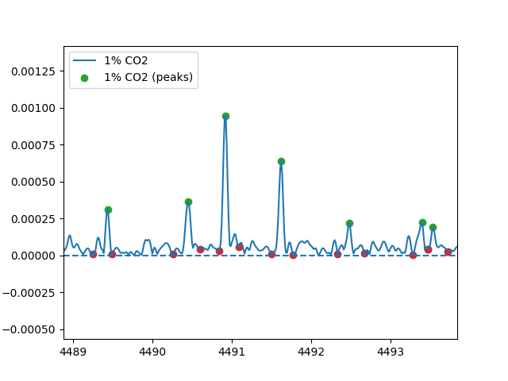

Usage
=====

.. _installation:

Installation
------------

For most of the features, simply drop mwspectk.py into your project folder
and import it.

**(WIP)** In order to access constant difference pattern finding, you'll
need to compile CDP_Finder.cpp into an executable and place it in the same
directory as your project.

.. _importing_spectra

Importing Spectra
-----------------
Experimental Spectra
____________________

mwspectk.py has several different functions for importing different data types.
For experimental spectrum that contain every data point, :code:`get_spectrum`
should be used.

.. code-block:: python

    from mwspectk import *

    example = get_spectrum("SpectrumFile.ft", name="Spectrum", inten_thresh=0.15,
                           prominence=0.15, wlen=30)

This function will load all of the spectrum data into a variable, in this case
the :code:`example` variable. The first argument is the file name of the data,
:code:`name` is just a simple name you can give it.

This function will also perform a peak-pick on the data, which is necessary for
many of the other functions in this mwspectk.py and which is why
:code:`inten_thresh`, :code:`prominence` and :code:`wlen` are required.
These are important and represent:

* :code:`inten_thresh`: The minimum intensity that should define a peak
* :code:`prominence`: A measure of how different a peak should be from its surroundings
* :code:`wlen`: How many data points should be considered when identifying a peak

It'll be important to tune all of these parameters to get the most accurate
depiction of peaks.

The best way to achieve the best peak pick is to graph the current peak-pick,
and then repeatedly adjust the parameters until a desirable peak-pick is achieved.

.. code-block:: python

    from mwspectk import *

    example = get_spectrum("SpectrumFile.ft", name="Spectrum", inten_thresh=0.15,
                           prominence=0.15, wlen=30)

    example.plot()
    example.peaks.plot(scatter=True, sides=True)

    show()

:code:`plot()` will show the whole spectrum, while :code:`peaks.plot()` shows the the
peak picks. Enabling :code:`scatter` will turn the peak picks into a scatter plot
and :code:`sides` will show the determined sides of each peak. :code:`show()` is
required to display the graph after you are finished calling :code:`plot()`

Figure 1: Snapshot of a spectrum displaying the peak picks and determined sides

:code:`prominence` and :code:`wlen` are a bit difficult to comprehend, but they should
be adjusted based on:

* :code:`prominence`: Decrease if peaks close together are not getting separated,increase if slight peak blemishes are being counted as peaks
* :code:`wlen`: Decrease if peak sides are too wide, increase if too skinny

Predicted Spectra
_________________

Currently, mwspectk.py only accepts files generated from SPFIT/SPCAT.
:code:`.lin` files can be obtained by calling :code:`get_lin()`, and
:code:`.cat` files can be obtained by calling :code:`get_cat()`.
These functions only need a file name and a simple name to work.

.. code-block:: python

    from mwspectk import *

    cat_file = get_cat("File1.cat", "Cat File")
    lin_file = get_lin("File2.lin", "Lin File")

Correlating Spectral Peaks
---------------

Finding peaks that share the same frequency between different spectra is as simple
as calling :code:`same_peaks_as()` from any spectrum :code:`peaks` object.

.. code-block:: python

    self_inds, other_inds = spectrum1.same_peaks_as(other=spectrum2, freq_variability=0.05)

The parameter :code:`other` is the other spectrum which correlated peaks will be found for.
:code:`freq_variability` is the maximum difference in frequency between two peaks for
them to be correlated.

The two returned objects, :code:`self_inds` and :code:`other_inds` are arrays
which stand the indexes for each spectrum which are correlated. These two arrays
are indexed matched, so applying the same index on both arrays will provide the two
peaks that have been correlated.

Cutting Peaks From Another Spectrum
-----------------------------------

Cutting from one another will result in:

* All peaks from the spectrum being deleted
* Replacing the area occupied by the peak with a horizontal line

The easiest way to remove peaks is by calling :code:`remove_peaks_of()` on
a spectrum object

.. code-block:: python

    inds = spectrum1.remove_peaks_of(other={spectrum2, spectrum3}, freq_variability=0.50)

The parameter :code:`other` will be all of the other spectra that wish to be cut from
the spectrum the function was called on, and :code:`freq_variability` is the maximum
frequency difference between two peaks to be correlated.

The :code:`inds` object is a list of tuples. Each list element represents each
spectrum that was cut, and each tuple contains :code:`self_inds` and :code:`other_inds`,
which are lists of the indexes of the peaks correlated between the spectra, similar
to the lists returned from :code:`same_peaks_as`

