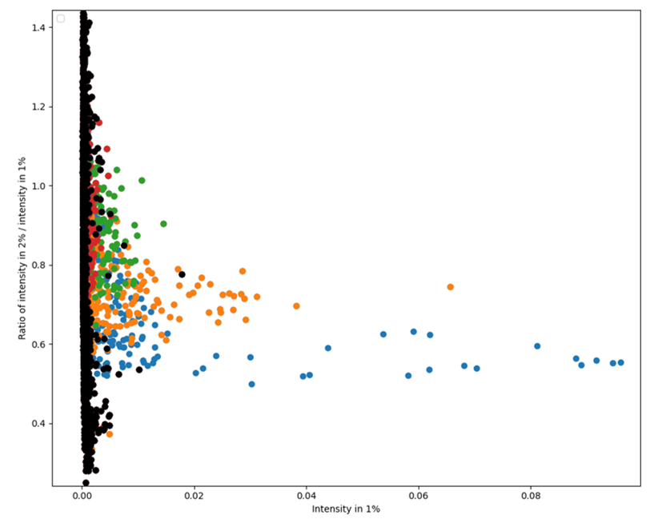

Usage
=====

.. _installation:

Installation
------------

For most of the features, simply drop mwspectk.py into your project folder
and import it.

**(WIP)** In order to access constant difference pattern finding, you'll
need to compile CDP_Finder.cpp into an executable and place it in the same
directory as your project.

.. _importing_spectra

Importing/Exporting Spectra
-----------------
Importing Experimental Spectra
____________________

mwspectk.py has several different functions for importing different data types.
For experimental spectrum that contain every data point, :code:`get_spectrum`
should be used.

.. code-block:: python

    from mwspectk import *

    example = get_spectrum("SpectrumFile.ft", name="Spectrum", inten_thresh=0.15,
                           prominence=0.15, wlen=30)

This function will load all of the spectrum data into a variable, in this case
the :code:`example` variable. The first argument is the file name of the data,
:code:`name` is just a simple name you can give it.

This function will also perform a peak-pick on the data, which is necessary for
many of the other functions in this mwspectk.py and which is why
:code:`inten_thresh`, :code:`prominence` and :code:`wlen` are required.
These are important and represent:

* :code:`inten_thresh`: The minimum intensity that should define a peak
* :code:`prominence`: A measure of how different a peak should be from its surroundings
* :code:`wlen`: How many data points should be considered when identifying a peak

It'll be important to tune all of these parameters to get the most accurate
depiction of peaks.

The best way to achieve the best peak pick is to graph the current peak-pick,
and then repeatedly adjust the parameters until a desirable peak-pick is achieved.

.. code-block:: python

    from mwspectk import *

    example = get_spectrum("SpectrumFile.ft", name="Spectrum", inten_thresh=0.15,
                           prominence=0.15, wlen=30)

    example.plot()
    example.peaks.plot(scatter=True, sides=True)

    show()

:code:`plot()` will show the whole spectrum, while :code:`peaks.plot()` shows the the
peak picks. Enabling :code:`scatter` will turn the peak picks into a scatter plot
and :code:`sides` will show the determined sides of each peak. :code:`show()` is
required to display the graph after you are finished calling :code:`plot()`

Figure 1: Snapshot of a spectrum displaying the peak picks and determined sides

:code:`prominence` and :code:`wlen` are a bit difficult to comprehend, but they should
be adjusted based on:

* :code:`prominence`: Decrease if peaks close together are not getting separated,increase if slight peak blemishes are being counted as peaks
* :code:`wlen`: Decrease if peak sides are too wide, increase if too skinny

Importing Predicted Spectra
_________________

Currently, mwspectk.py only accepts files generated from SPFIT/SPCAT.
:code:`.lin` files can be obtained by calling :code:`get_lin()`, and
:code:`.cat` files can be obtained by calling :code:`get_cat()`.
These functions only need a file name and a simple name to work.

.. code-block:: python

    from mwspectk import *

    cat_file = get_cat("File1.cat", "Cat File")
    lin_file = get_lin("File2.lin", "Lin File")

Exporting
_________

Exporting is done by calling :code:`export()` on any spectrum object.

.. code-block:: python

    spectrum1.export("csv", "File Name")

The first parameter will be the desired extension, and the second parameter is
the desired file name. :code:`export()` will automatically format the output
based on the extension, with the following extensions supported:

* .csv
* .txt
* .ft

**(TODO)**: The export system is a little outdated and needs to be worked on.

Correlating Spectral Peaks
---------------

Finding peaks that share the same frequency between different spectra is as simple
as calling :code:`same_peaks_as()` from any spectrum :code:`peaks` object.

.. code-block:: python

    self_inds, other_inds = spectrum1.same_peaks_as(other=spectrum2, freq_variability=0.05)

The parameter :code:`other` is the other spectrum which correlated peaks will be found for.
:code:`freq_variability` is the maximum difference in frequency between two peaks for
them to be correlated.

The two returned objects, :code:`self_inds` and :code:`other_inds` are arrays
which stand the indexes for each spectrum which are correlated. These two arrays
are indexed matched, so applying the same index on both arrays will provide the two
peaks that have been correlated.

Cutting Peaks From Another Spectrum
-----------------------------------

Cutting from one another will result in:

* All peaks from the spectrum being deleted
* Replacing the area occupied by the peak with a horizontal line

The easiest way to remove peaks is by calling :code:`remove_peaks_of()` on
a spectrum object

.. code-block:: python

    inds = spectrum1.remove_peaks_of(other={spectrum2, spectrum3}, freq_variability=0.50)

The parameter :code:`other` will be a :code:`set` of all of the other spectra that wish to be cut from
the spectrum the function was called on, and :code:`freq_variability` is the maximum
frequency difference between two peaks to be correlated.

The :code:`inds` object is a list of tuples. Each list element represents each
spectrum that was cut, and each tuple contains :code:`self_inds` and :code:`other_inds`,
which are lists of the indexes of the peaks correlated between the spectra, similar
to the lists returned from :code:`same_peaks_as`

Calculating Intensity Ratios
----------------------------

Calculating intensity ratios of the same peaks between two different spectra is
simple once both of them are loaded into Python by using the method
:code:`divide_by()`.

.. code-block:: python

    ratio = spectrum1.divide_by(other=spectrum2, freq_variability=0.05)

The parameter :code:`other` represents **the spectrum** :code:`divide_by()`
**was called on will be divided by**. The order is important here, as in this case
the ratios will be the result of **dividing the intensity in** :code:`spectrum1` **by the
intensity in** :code:`spectrum2`. The parameter :code:`freq_variability` represents the
maximum frequency difference for two peaks between spectra to be correlated.

The returned :code:`ratio` object contains a table of the intensity ratios and
the indexes of peaks from each spectrum it was calculated from.

Exporting
_________

Once a ratio is calculated, it will be stored in the spectrum as well. Exporting
the spectrum once a ratio is calculated will create a new column with the intensity
ratios, corresponding to the frequencies that were already in the spectrum.

Cutting Intensity Ratio Ranges
------------------------------

Once a ratio object is obtained, it can be used to cut a range of intensity
ratios from either the spectrum it was calculated from, or even the spectrum
it was divided by. This process will use the :code:`keep_ratio_of` method:

.. code-block:: python

    ratio = spectrum1.divide_by(other=spectrum2, freq_variability=0.05)

    spectrum1.keep_ratio_of(ratio, lbound=0.5, ubound=2.2)

:code:`ratio` is the ratio object calculated by :code`divide_by()`, and
:code:`lbound` and :code:`ubound` are the lower and upper limits of ratios you
want to keep. In this case, :code:`spectrum1` will only be left with peaks
that have an intensity ratio of 0.5 < x < 2.2.

This function would work perfectly fine if called on :code:`spectrum2` in this case.

Generating an RVI Plot
----------------------

RVI plots are constructed the most simply using :code:`construct_RVI()`:

.. code-block:: python

    construct_RVI(parent_spec=spectrum1, div_spec=spectrum2, cut={spectrum3},
                  freq_variability=0.05, x_label="Intensity of Spectrum1")

This will automatically construct a plot which will be seen once :code:`show()`
is called.

The parameters :code:`parent_spec` and :code:`div_spec` are the main spectrum
and the spectrum that the main will be divided by, respectively. **The intensity
graphed on the x-axis will be the intensities from** :code:`parent_spec`.

The :code:`cut` parameter is a special parameter that takes a set of spectra. Any spectra
put into this set will be correlated with the peaks and their respective peak points
will be highlighted with a color. **All uncorrelated peaks will appear black**.

Like the other functions, :code:`freq_variability` is simply the maximum frequency difference
between peaks between different spectra to be correlated.

Figure 2: An image of a constructed RVI plot

In this figure, all of the points that have a color are points that were correlated with
a spectrum in the set provided to :code:`cut`.